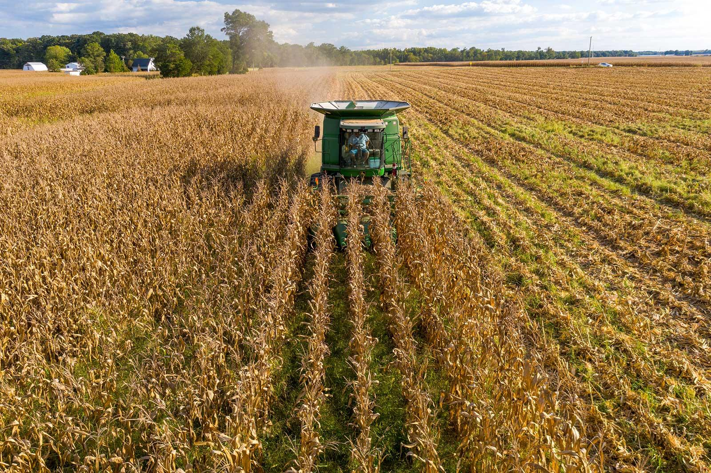
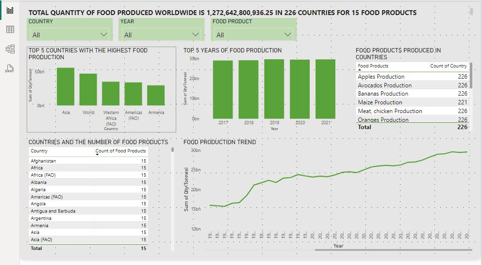
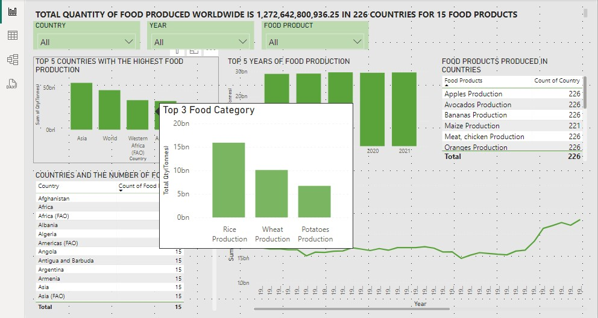
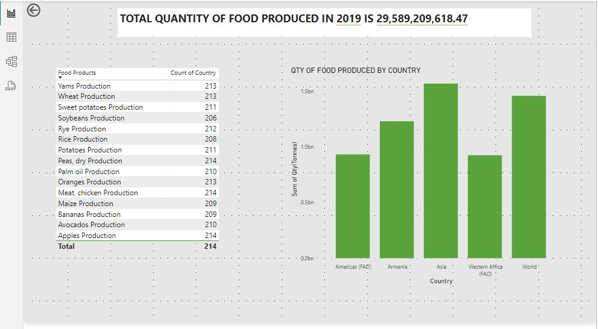
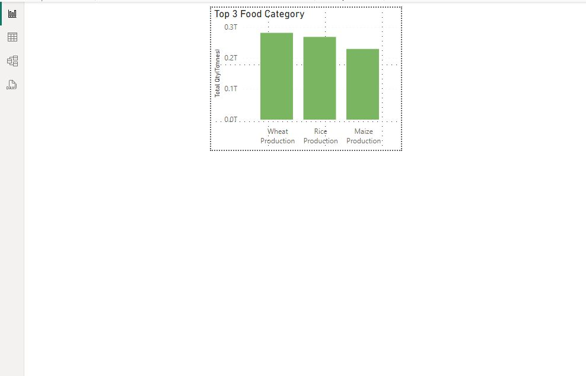

# World-Food-Production

## Introduction
This is a PowerBI project on World Food Production from 1961 - 2021  The project is to analyze and derive insights to answer crucial  question and 
help the Continent make data driven decisions.

## Skiils demonstrated
The following PowerBI features were incorporated;

- Tooltip
- Drillthrough
- Page navigation
- Buttons
- Filters
- AI feature on PowerBI (Smart Narrative)

## Problem Statement
1. Countries with the highest food productiobn
2. The Years of high food production
3. Number of food produced in the countries
4. The trend of food production from 1961 - 2021
5. The top food categories produced by each country

**_Drillthrough_** was done to make the report dynamic for more information on the quantity of food products produced by country and also the 
number of countries that produces each food product.

**_Tooltip_** was done on the countries by showing the Top 3 catgories of food products by the country.

Drillthrough                             |        Tooltip
:---------------------------------------:|:----------------------------:
                   |   

## Analysis
Total Quantity of Food Produced by the World is over 1 Trillion Tonnes; 
The Top 5 years of Food Produced was in 2017 - 2021...This shows food production has been growing
The Top 5 Countries with the highest in food production is Asia with Rice, Wheat and Maize as the top food categories produced.
